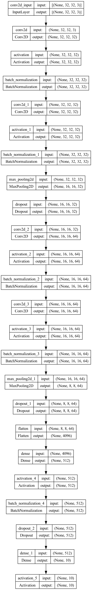

# CNN
# pyimagesearch/nn/conv
### This is where the implementation of CNN's are stored.
1. ShallowNet: This is an implementation of a simple CNN with 1 convolutional layer and 1 fully connected layer.  ShallowNet, although simple, achieves better results than the manually implemented NN, NeuralNetwork, stored in pyimagesearch/nn, when training on the animals dataset. The animals dataset includes images of dogs, cats, and pandas. The animals dataset is stored on my local device and includes more than 3000 png images. Thus, this dataset is not included in the repo
2. LeNet: This is an implementation of the famous LeNet CNN. It achieves ~98% accuracy on the MNIST dataset. However, LeNet is still not very good for the cifar10 dataset
3. MiniVGGNet: This is a simple implementation of the famous VGGNet. It does a decent job when training on the cifar10 dataset, achieving ~84% accuracy.

# driver scripts:
1. shallownet_cifar10.py: a driver script for training the ShallowNet CNN on the CIFAR10 dataset 
2. lenet_mnist.py: a driver script for training the LeNet CNN on the MNIST dataset
3. minivggnet_cifar10.py: a driver script for training the miniVGGNet CNN on the CIFAR10 dataset 
4. cifar10_checkpoint_improvements.py: a driver script that utilizes callback checkpoints while training MiniVGGNet
5. explore_learning_rates.py: a driver script that will compare the training results of MiniVGGNet on CIFAR10 using various different learning rate decay strategies

# Other utility functions:
1. classify_image.py: used to access pretrained models and architectures implemented by experts, such as VGGNet
2. load_model.py: used to demonstrate how to load the weights of a model that can be later used for predictions
3. visualize_net.py: used to demonstrate how to generate a png that depicts the structure of a CNN
4. cifar10_checkpoint_improvements.py: used to demonstrate how to incorporate callbacks in the middle of training to save weights in the middle of training
5. explore_learning_rates.py: This script should most certalinly be run with a GPU. This script is meant to explore how different learning rate decay strategies will affect the accuracy/loss of a model (in this case, miniVGG) when trained on the CIFAR10 dataset. In this script, the "default" learning rate decay strategy implemented by tensorflow is compared to "step-wise" strategies, the "linear" strategy, and the "polynomial" strategy.
6. test_script.py: just a scrach pad script. Used to demonstrate the functionality of the `image_to_array` and `array_to_image` functions of tensorflow.keras
7. pyimagesearch/learning_rate_schedulers.py: Using inheritance, this script implements the LearningRateSchedule class and its subclasses, allowing the user to compare these learning rate strategies with each other for optimal training results

# MiniVGGNet visualized:

# training_result_diagrams:
### This is where graph representations of the training processes of each of the driver scripts are stored
1. ShallowNet on CIFAR10: high amount of overfitting with validation accuracy of ~58%

2. LeNet on MNIST: low amount of overfitting with validation accuracy of ~98%
- batch_size = 64; epochs = 20

3. MiniVGGNet on CIFAR10: high amount of overfitting with validation accuracy of ~86%
- batch_size = 64; epochs = 40; momentum = 0.9; nesterov = True; includes learning_rate decay

# weights:
### Results of trained weights. Since these files tend to be big, only one file is included as a sample. This file was generated by training MiniVGGNet on the CIFAR10 dataset
- minivggnet_batchsize64_epoch40_decay_momentum_nesterov_normalization.hdf5